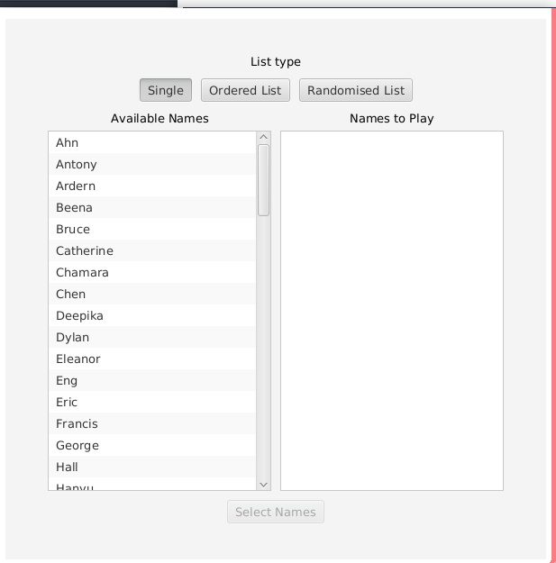

# se206_ass3
This is a java applet which helps to record audio, playback, and practise names in general. 
Multiple reocrdings of a single name can be quickly and easily viewed, and a small prompt ensures that the user knows when a bad Recording is present.

Please run java -jar se206_ass3.jar on the command line to start the app.

To add a name onto the selected list, please click on it in the available names list and to remove click on the other list.

If no ‘audioFiles’ folder is present, then it will automatically be generated on the first run.

Please place all database files here.
User made recordings may be found in the userFiles folder

If any recording are reported as bad quality, they may be found in the ‘logs’ folder under badRecordings.txt
Any exported lists may also be found here

There are three main windows with one Microphone Test.

Users can choose the names they want to practise, then select one of version to play.

It provides a Record window for users who want to record their own version and compare with an original version.
